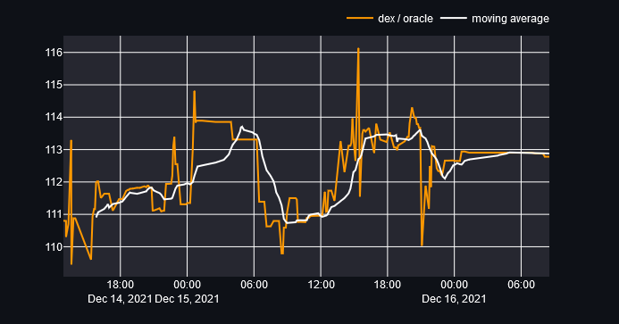

# defichain-stockstoken-board

The main strategy is to use the market inefficiencies of the dex to make a small but constant profit by trading stable stocks token against **DUSD**.
On defichain the stock token are traded against **DUSD** a not so stable _stablecoin_. The price of **DUSD** is changing slightly due to the change in market demand. Next to this, the prices of the stock tokes also changes slightly.
[video](https://www.youtube.com/watch?v=ye7lmVai4Os&t=9s)
There is the _real price_ of the stock token from _oracles_ (off-chain data sources) and there is the _dex price_ expressed in _DUSD_.

the prices For the strategy to work, the assets should have a vary low volatility like:

- **dGLD** - gold
- **dSLV** - silva
- **dURTH** - msci world etf

This leaves us with a constant moving price or value of **DUSD** against a stable token like **DGLD**, **DSLV** or **DURTH**.
Now comes the important part, since the price of the assets of the dex is expressed in **DUSD** and this assets is oscillating in value, there is a predictable and constant change in the value of the asset, which can be used to buy when the price is low and sell when the price is high.

The great thing about this strategy is, that its pretty safe! The change in the price **DUSD** / asset is a constant oscillation of about 4 to 6 percent change, this is not like regular price volatility, its much simpler to spot the local maximum and minimum.
The only assumption and precondition is:

- **The price of the assets needs to be as stable as possible**

This changes can be used to buy when the price is low and sell when the prices are highter.
The prices are the real dex prices of the stocks expressed as deviation of the oracle price. Since most stocks are overpriced the values range between 110 and 120 most of the time.

The app is live under: https://share.streamlit.io/jesjehle/defichain-stockstoken-board/app.py
